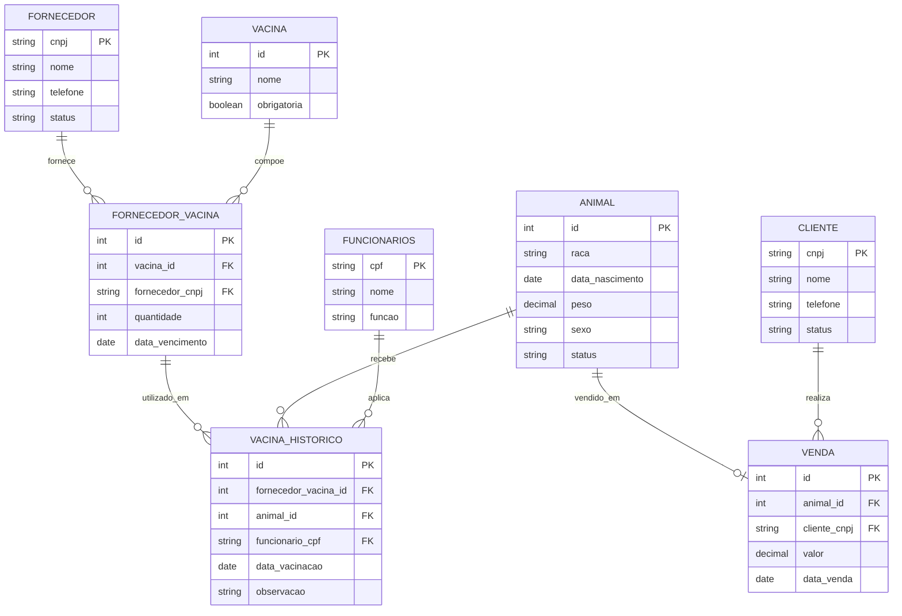

# Esquema do Banco de Dados — Sistema de Haras

## TABELA 1 — `funcionarios`

### Finalidade 
Armazena os funcionários do haras responsáveis pelas atividades administrativas, manejo dos animais e vacinação.

### Principais atributos
* `cpf`: identificação única do funcionário.
* `nome`: nome completo.
* `funcao`: cargo exercido no haras.

### Regras
A função é limitada aos valores:
* VETERINARIO
* GERENTE
* TRATADOR
* ADMINISTRATIVO

---

## TABELA 2 — `fornecedor`

### Finalidade
Armazena os fornecedores responsáveis pelo fornecimento de vacinas.

### Principais atributos
* `cnpj`: identificação única do fornecedor.
* `nome`: nome da empresa.
* `telefone`: contato.
* `status`: situação atual do fornecedor.

### Regras
O fornecedor pode estar:
* ATIVO
* INATIVO

---

## TABELA 3 — `cliente`

### Finalidade
Armazena os clientes responsáveis pela compra dos animais.

### Principais atributos
* `cnpj`: identificação única do cliente.
* `nome`: nome ou razão social.
* `telefone`: contato.
* `status`: situação do cliente.

### Regras
O cliente pode estar:
* ATIVO
* INATIVO

---

## TABELA 4 — `animal`

### Finalidade
Armazena as informações dos animais pertencentes ao haras.

### Principais atributos
* `raca`
* `data_nascimento`
* `peso`
* `sexo`
* `status`

### Regras
O sexo pode ser:
* M
* F

O status pode ser:
* DISPONIVEL
* VENDIDO

---

## TABELA 5 — `vacina`

### Finalidade
Armazena as vacinas cadastradas no sistema.

### Principais atributos
* `nome`
* `obrigatoria`

### Regras
O atributo `obrigatoria` indica se a vacina é exigida para que um animal possa ser comercializado.

---

## TABELA 6 — `fornecedor_vacina`

### Finalidade
Controla os lotes de vacinas fornecidos pelos fornecedores.

### Principais atributos
* `vacina_id`
* `fornecedor_id`
* `quantidade`
* `data_vencimento`

### Relacionamentos
* Relaciona fornecedores e vacinas.
* Permite controlar estoque e validade dos lotes.

---

## TABELA 7 — `vacina_historico`

### Finalidade
Armazena o histórico de vacinação dos animais.

### Principais atributos
* `fornecedor_vacina_id`
* `animal_id`
* `funcionario_id`
* `data_vacinacao`
* `observacao`

### Relacionamentos
* Animal vacinado.
* Funcionário responsável pela aplicação.
* Lote de vacina utilizado.

---

## TABELA 8 — `venda`

### Finalidade
Armazena as vendas realizadas pelo haras.

### Principais atributos
* `animal_id`
* `cliente_id`
* `valor`
* `data_venda`

### Relacionamentos
* Cada venda está associada a um cliente.
* Cada venda está associada a um único animal.

---

## Relacionamentos Gerais
* Um fornecedor pode fornecer vários lotes de vacina.
* Uma vacina pode estar presente em vários lotes.
* Um animal pode possuir vários registros de vacinação.
* Um funcionário pode registrar várias vacinações.
* Um cliente pode realizar várias compras.
* Um animal pode ser vendido apenas uma vez.

---

## UML das Tabelas (Diagrama Entidade-Relacionamento)

---

## Normalização do Esquema

**1ª Forma Normal (1FN)**
Todas as tabelas do modelo possuem apenas atributos atômicos (não há listas, arrays ou grupos repetitivos em nenhuma coluna) e cada linha é identificada por uma chave primária única. Portanto, todas as tabelas satisfazem a 1FN.

**2ª Forma Normal (2FN)**
A 2FN exige que, além de estar na 1FN, não existam **dependências parciais** — ou seja, atributos não-chave que dependam apenas de *parte* de uma chave primária composta.

Essa situação só pode ocorrer em tabelas cuja chave primária é composta por mais de um atributo. Analisando o esquema:

- `funcionarios`, `fornecedor`, `cliente`, `vacina` possuem chave primária simples (`cpf`, `cnpj`, `cnpj`, e um identificador próprio da vacina, respectivamente). Como não há chave composta, não existe a possibilidade de dependência parcial — logo, a 2FN é satisfeita trivialmente.

- `animal` e `venda` também utilizam chave primária simples (um identificador próprio do animal e da venda). Os demais atributos (`raca`, `peso`, `sexo`, `status`, `valor`, `data_venda` etc.) dependem integralmente dessa chave, e não de nenhuma outra combinação de colunas.

- `fornecedor_vacina`, que relaciona `fornecedor_id` e `vacina_id`, é a única tabela em que uma dependência parcial poderia surgir, caso `quantidade` ou `data_vencimento` dependessem de apenas um dos dois identificadores isoladamente. Isso não ocorre: um mesmo fornecedor pode fornecer vários lotes diferentes da mesma vacina (com quantidades e validades distintas), e uma mesma vacina pode vir de fornecedores diferentes — logo `quantidade` e `data_vencimento` só fazem sentido em função do **lote como um todo** (a combinação fornecedor + vacina + o próprio registro do lote), e não de uma parte isolada da chave.

- `vacina_historico` referencia `fornecedor_vacina_id`, `animal_id` e `funcionario_id` como chaves estrangeiras, mas possui um identificador próprio como chave primária (não uma chave composta por essas três colunas). Assim, `data_vacinacao` e `observacao` dependem inteiramente da chave primária do registro de histórico, sem risco de dependência parcial.

Como nenhuma tabela apresenta atributo não-chave dependendo de apenas parte de uma chave composta, o modelo está normalizado até a **2ª Forma Normal**.
